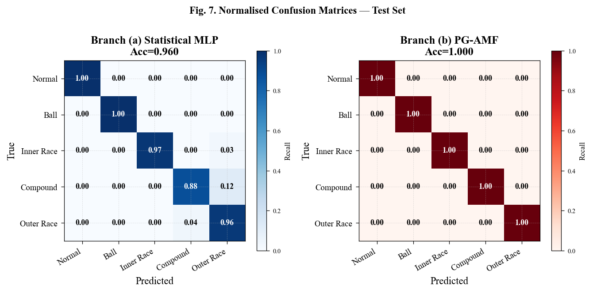
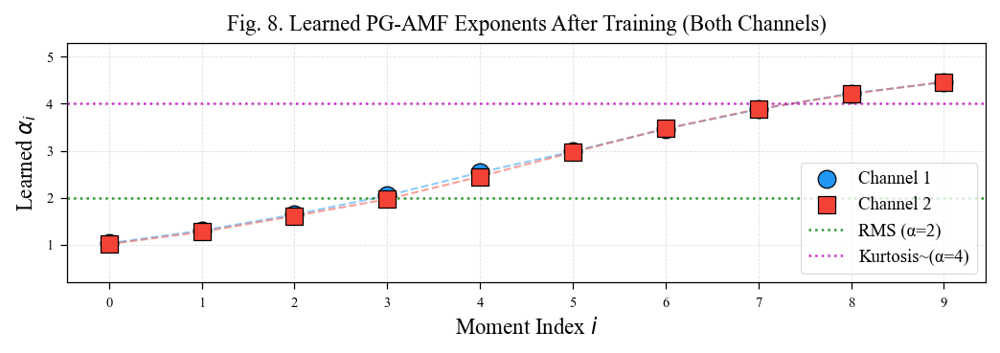

# PG-AMF: Physics-Guided Adaptive Moment Features for Bearing Fault Diagnosis

[](https://www.python.org/)
[](https://pytorch.org/)
[](LICENSE)
[](https://www.sciencedirect.com/science/article/pii/S2352340919309904)

**PG-AMF v4** is a physics-guided deep learning framework for rotating machinery bearing fault diagnosis. It replaces fixed hand-crafted statistical features with *learnable generalised moment exponents* that adapt to the fault type during training, achieving **100% test accuracy** on the XJTU Gearbox Bearing 61800 dataset with 5-class fault classification (Normal, Ball, Inner Race, Compound, Outer Race).

---

## Key Results

> Trained and evaluated on the **XJTU Gearbox Bearing 61800** dataset 11.6 million raw vibration samples, two accelerometer channels, five fault classes, 200 segments per class at 20 480 Hz.

### Hold-Out Test Set (150 samples)

| Method | Accuracy | Macro-F1 | Parameters |
|--------|:--------:|:--------:|:----------:|
| (a) Statistical MLP — 12 fixed features | 96.00% | 0.960 | 10 245 |
| **(b) PG-AMF v4 — learned α exponents** | **100.00%** | **1.000** | **44 065** |

PG-AMF achieves a **perfect diagonal confusion matrix** across all five fault types including the hardest case: Compound multi-fault (Inner + Outer + Ball simultaneously).

### 5-Fold Cross-Validation

| Method | Accuracy | Macro-F1 |
|--------|:--------:|:--------:|
| (a) Statistical MLP | 98.82% ± 0.83% | 98.82% ± 0.84% |
| **(b) PG-AMF v4** | **99.53% ± 0.69%** | **99.53% ± 0.68%** |

### Feature Space Quality (Fisher Discriminant Ratio)

| Feature Set | Dimensions | FDR |
|-------------|:----------:|:---:|
| Statistical baseline (fixed) | 12 | 278 |
| **PG-AMF (learned α)** | **60** | **680 801** |

Trained PG-AMF features are **~2 440× more discriminative** than fixed statistical features by FDR.

---

## Results Visualised

### Confusion Matrices — Test Set
*Left: Statistical MLP (96% accuracy). Right: PG-AMF (100% accuracy, perfect diagonal).*



---

### Learned α-Exponent Distribution
*The model learns a diverse, monotonically increasing set of moment orders from α≈1.0 (mean absolute) up to α≈4.4 (kurtosis-like). Both channels converge to nearly identical exponents, confirming physical consistency.*




---

## Repository Structure

```
pg_amf_bearing/
├── configs/               default · data · model · train YAMLs
├── data/sample/           place XJTU .txt files here
├── docs/figures/          all 12 result figures (notebook-generated)
├── notebooks/             experiments.ipynb — interactive companion
├── src/                   8 focused, reusable modules
│   ├── dataset.py         BearingDataLoader + synthetic fallback
│   ├── preprocessing.py   segmentation, stat features, scaler
│   ├── model.py           PGAMFLayer · CrossChannelFusion · classifiers
│   ├── trainer.py         train_basic · train_smooth · make_loaders
│   ├── evaluate.py        metrics · FDR · 5-fold CV
│   ├── inference.py       PGAMFInference · StatMLPInference
│   ├── visualization.py   12 IEEE figure generators
│   └── utils.py           config · seeding · device · char-freqs
├── scripts/               train · evaluate · infer · generate_figures
├── outputs/               checkpoints · figures · results (gitignored)
└── tests/                 30 unit + integration tests
```

---

## Method: How PG-AMF Works

Standard bearing fault diagnosis extracts fixed statistical features — RMS, kurtosis, crest factor — chosen by engineers before training. PG-AMF replaces this with a learnable layer that discovers the optimal moment orders during training.

**For each channel and each learnable exponent αᵢ, three moment families are computed:**

| Family | Formula | What it captures |
|--------|---------|-----------------|
| Absolute | `(1/T) Σ \|x_t\|^αᵢ` | Energy distribution |
| Signed | `(1/T) Σ sign(x_t)\|x_t\|^αᵢ` | Signal asymmetry |
| AC-coupled | `(1/T) Σ \|x_t − x̄\|^αᵢ` | DC-free impulsiveness |

With F=10 exponents, 3 families, and 2 channels the result is a **60-dimensional physics-informed feature vector** — 5× richer than the 12-dimensional statistical baseline.

**Cross-channel fusion** replaces naive concatenation with a bilinear gated residual that captures the interaction between horizontal (Ch1) and vertical (Ch2) accelerometer signals.

**Training loss** combines focal cross-entropy (γ=2) with two regularisers — a diversity term that prevents exponent collapse, and a cosine compactness term that tightens feature clusters.

---

## Dataset & Signal Processing

| Parameter | Value |
|-----------|-------|
| Dataset | XJTU Gearbox Bearing 61800 |
| Sampling frequency | 20 480 Hz |
| Window length | 8 192 samples (400 ms) |
| Overlap | 50% |
| Channels | 2 (horizontal + vertical accelerometer) |
| Fault classes | 5 (Normal, Ball, Inner Race, Compound, Outer Race) |
| Characteristic frequencies | BPFO 89.8 Hz · BPFI 120.2 Hz · BSF 101.4 Hz · FTF 12.8 Hz |

---

## Configuration

All hyper-parameters are in `configs/`. Key values:

| Config file | Key parameter | Default |
|-------------|--------------|---------|
| `model.yaml` | `pgamf.F` — learnable exponents per channel | 10 |
| `model.yaml` | `pgamf.alpha_min / alpha_max` — exponent range | 0.5 – 5.0 |
| `train.yaml` | `pgamf.focal_gamma` | 2.0 |
| `train.yaml` | `pgamf.lambda_div` — diversity weight | 0.01 |
| `train.yaml` | `epochs / patience` | 200 / 25 |

Override on the command line: `python scripts/train.py --epochs 300 --batch_size 32`


## Citation

```bibtex
@misc{kumar2026parametricgeneralizedadaptivemoment,
      title={Parametric Generalized Adaptive Moment Features (PG-AMF) for Bearing Fault Diagnosis and Machine Health Monitoring}, 
      author={Rajeev Kumar},
      year={2026},
      eprint={2606.26317},
      archivePrefix={arXiv},
      primaryClass={eess.SP},
      url={https://arxiv.org/abs/2606.26317}, 
}
```
PG-AMF: Physics-Guided Adaptive Moment Features for Bearing Fault Diagnosis 

[Mauscript(Pdf)](https://arxiv.org/abs/2606.26317)
---

## License

MIT — see [LICENSE](LICENSE).
